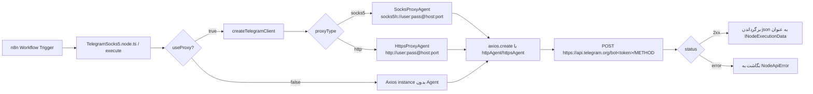

# n8n-nodes-telegram-socks5

[](https://www.npmjs.com/package/n8n-nodes-telegram-socks5)
[](./LICENSE)
[](https://docs.n8n.io/integrations/community-nodes/)

نود کامیونیتی **n8n** برای **Telegram Bot API** با پشتیبانی بومی (Native) از پروکسی **SOCKS5** و **HTTP** — برای زیرساخت‌هایی که دسترسی مستقیم به `api.telegram.org` محدود یا مسدود است.

بر خلاف نود رسمی Telegram در n8n که از موتور HTTP داخلی (`this.helpers.httpRequest` مبتنی بر کتابخانه `got`) استفاده می‌کند و پشتیبانی از SOCKS5 ندارد، این نود یک لایه انتقال (Transport Layer) مستقل بر پایه **Axios + Agent تزریق‌شده** پیاده‌سازی می‌کند که امکان مسیریابی کامل ترافیک از طریق SOCKS5h/HTTP Proxy را فراهم می‌کند.

---

## فهرست مطالب

- [ویژگی‌ها](#ویژگی‌ها)
- [معماری](#معماری)
- [نصب](#نصب)
- [پیکربندی Credential](#پیکربندی-credential)
- [عملیات پشتیبانی‌شده](#عملیات-پشتیبانی‌شده)
- [مرجع فنی پارامترها](#مرجع-فنی-پارامترها)
- [مدیریت خطا](#مدیریت-خطا)
- [توسعه و Build محلی](#توسعه-و-build-محلی)
- [تست](#تست)
- [محدودیت‌های شناخته‌شده](#محدودیت‌های-شناخته‌شده)
- [Roadmap](#roadmap)
- [مشارکت](#مشارکت)
- [لایسنس](#لایسنس)

---

## ویژگی‌ها

| قابلیت | توضیح |
|---|---|
| پروکسی SOCKS5 بومی | با `socks-proxy-agent`، شامل حالت `socks5h` (DNS از طریق پروکسی resolve می‌شود) |
| پروکسی HTTP/HTTPS | با `https-proxy-agent` برای CONNECT tunneling |
| احراز هویت پروکسی | نام کاربری/رمز عبور اختیاری برای هر دو نوع پروکسی |
| ارسال پیام متنی | `sendMessage` با `parse_mode`, `reply_to_message_id`, `disable_notification`, `protect_content` |
| ارسال عکس/فایل | `sendPhoto` / `sendDocument` از URL، `file_id` تلگرام، یا Binary Property ورودی (multipart/form-data) |
| مدیریت خطای استاندارد n8n | خطاهای Axios به `NodeApiError` نگاشت می‌شوند؛ `continueOnFail()` پشتیبانی می‌شود |
| Type-safety کامل | تایپ‌دهی صریح با `INodeType`, `ICredentialType`, `IExecuteFunctions` از `n8n-workflow` |

---

## معماری

### دیاگرام جریان اجرا



### چرا از `this.helpers.httpRequest` استفاده نشده؟

موتور HTTP توکار n8n (بر پایه `got`) پشتیبانی رسمی و پایداری برای SOCKS5 Agent ندارد و امکان تزریق مستقیم `Agent` سفارشی را — به‌خصوص هنگام کار با `multipart/form-data` برای آپلود فایل — به‌سادگی نمی‌دهد. به همین دلیل تصمیم گرفته شد لایه انتقال به‌صورت مستقل با **Axios** ساخته شود که:

1. امکان تزریق `httpAgent` / `httpsAgent` سفارشی به ازای هر Credential را می‌دهد.
2. با `axios.proxy = false` از تداخل مکانیزم پروکسی داخلی خود Axios با Agent تزریق‌شده جلوگیری می‌کند.
3. برای درخواست‌های چندبخشی (`sendPhoto`/`sendDocument`) از `form-data` استفاده می‌کند که هدرهای `Content-Type: multipart/form-data; boundary=...` را به‌صورت خودکار می‌سازد.

### ماژول‌های اصلی کد

```
nodes/TelegramSocks5/TelegramSocks5.node.ts
├── createTelegramClient(credentials)   → می‌سازد یک AxiosInstance با baseURL و Agent مناسب
├── class TelegramSocks5 implements INodeType
│   ├── description: INodeTypeDescription   → تعریف UI (فیلدها، Operations، displayOptions)
│   └── execute()                            → حلقه روی items ورودی و فراخوانی Telegram Bot API
```

نگاشت Agent بر اساس نوع پروکسی:

| `proxyType` | کتابخانه | فرمت URL Agent |
|---|---|---|
| `socks5` | `socks-proxy-agent` | `socks5h://[user:pass@]host:port` |
| `http` | `https-proxy-agent` | `http://[user:pass@]host:port` |

> از پیشوند `socks5h` (به‌جای `socks5`) استفاده شده تا resolve نام دامنه (`api.telegram.org`) نیز از طریق پروکسی انجام شود و DNS لو نرود (جلوگیری از DNS Leak).

---

## نصب

### از طریق پنل n8n (Community Nodes)

1. **Settings → Community Nodes → Install**
2. نام پکیج را وارد کنید: `n8n-nodes-telegram-socks5`
3. تأیید نصب (توجه: n8n هشدار امنیتی استاندارد کد شخص ثالث را نمایش می‌دهد)

### نصب دستی (self-hosted / Docker)

```bash
cd ~/.n8n/custom   # یا مسیر پیکربندی‌شده N8N_CUSTOM_EXTENSIONS
npm install n8n-nodes-telegram-socks5
```

سپس سرویس n8n را ری‌استارت کنید.

### در Dockerfile

```dockerfile
FROM n8nio/n8n:latest
USER root
RUN npm install -g n8n-nodes-telegram-socks5
USER node
```

---

## پیکربندی Credential

نوع Credential: **`telegramSocks5Api`** (نمایش داده‌شده با نام «Telegram (SOCKS5/HTTP Proxy) API»)

| فیلد | Name (Internal) | نوع | پیش‌فرض | الزامی | توضیح |
|---|---|---|---|---|---|
| Bot Token | `botToken` | `string` (password) | `''` | بله | توکن از `@BotFather` |
| Use Proxy | `useProxy` | `boolean` | `true` | - | فعال/غیرفعال‌سازی مسیر پروکسی |
| Proxy Type | `proxyType` | `options` (`socks5` \| `http`) | `socks5` | وقتی `useProxy=true` | نوع پروکسی |
| Proxy Host | `proxyHost` | `string` | `''` | وقتی `useProxy=true` | هاست/IP سرور پروکسی |
| Proxy Port | `proxyPort` | `number` | `1080` | وقتی `useProxy=true` | پورت پروکسی |
| Proxy Username | `proxyUser` | `string` | `''` | خیر | نام کاربری احراز هویت پروکسی |
| Proxy Password | `proxyPassword` | `string` (password) | `''` | خیر | رمز عبور احراز هویت پروکسی |

### نکته درباره دکمه Test

مکانیزم استاندارد تست Credential در n8n (`ICredentialTestRequest`) درخواست را از طریق موتور HTTP داخلی n8n می‌فرستد و امکان تزریق Agent سفارشی SOCKS5/HTTP را نمی‌دهد. بنابراین دکمه **Test this credential** فقط صحت **Bot Token** را با یک درخواست مستقیم (بدون پروکسی) به `GET /getMe` بررسی می‌کند. اعتبارسنجی واقعی مسیر پروکسی، هنگام اجرای نود در یک Workflow واقعی انجام می‌شود.

---

## عملیات پشتیبانی‌شده

### 1. `Send Message` → `sendMessage`

| پارامتر UI | فیلد API تلگرام | نوع | توضیح |
|---|---|---|---|
| Chat ID | `chat_id` | string | شناسه چت یا `@username` |
| Text | `text` | string | متن پیام |
| Parse Mode | `parse_mode` | `Markdown` \| `MarkdownV2` \| `HTML` \| — | نحوه پارس کردن فرمت متن |
| Reply To Message ID | `reply_to_message_id` | number | ارسال به‌عنوان پاسخ |
| Additional Fields → Disable Notification | `disable_notification` | boolean | ارسال بی‌صدا |
| Additional Fields → Protect Content | `protect_content` | boolean | جلوگیری از فوروارد/ذخیره |

### 2. `Send Photo` → `sendPhoto`

### 3. `Send Document` → `sendDocument`

هر دو عملیات از سه منبع داده پشتیبانی می‌کنند:

| منبع | نحوه تنظیم |
|---|---|
| URL از راه دور | `Binary Data = false` + `File URL = https://...` |
| `file_id` موجود تلگرام | `Binary Data = false` + `File URL = <file_id>` |
| داده باینری ورودی (از نود قبلی) | `Binary Data = true` + `Binary Property = data` (یا نام دلخواه) |

درخواست این دو عملیات به‌صورت `multipart/form-data` با کتابخانه `form-data` ساخته می‌شود، نه JSON.

---

## مرجع فنی پارامترها

ساختار داخلی درخواست‌ها دقیقاً منطبق با [Telegram Bot API](https://core.telegram.org/bots/api) است:

```http
POST https://api.telegram.org/bot<BOT_TOKEN>/sendMessage
Content-Type: application/json

{
  "chat_id": "123456789",
  "text": "سلام دنیا",
  "parse_mode": "HTML",
  "reply_to_message_id": 42,
  "disable_notification": false
}
```

```http
POST https://api.telegram.org/bot<BOT_TOKEN>/sendPhoto
Content-Type: multipart/form-data; boundary=...

--boundary
Content-Disposition: form-data; name="chat_id"

123456789
--boundary
Content-Disposition: form-data; name="photo"; filename="image.jpg"
Content-Type: image/jpeg

<binary bytes>
--boundary--
```

---

## مدیریت خطا

```typescript
if (axios.isAxiosError(error)) {
    const description = (error.response?.data as IDataObject)?.description ?? error.message;
    throw new NodeApiError(this.getNode(), (error.response?.data as any) ?? {}, {
        message: `Telegram API request failed: ${description}`,
        description: String(description),
        itemIndex: i,
    });
}
```

- خطاهای شبکه‌ای (Timeout، اتصال رد شده به پروکسی، DNS) و خطاهای سطح Telegram API (مثل `400 Bad Request: chat not found`) هر دو به `NodeApiError` نگاشت می‌شوند تا در UI پیام خوانا نمایش داده شود.
- در صورت فعال بودن **Continue On Fail** در تنظیمات نود، خطای هر آیتم در فیلد `error` خروجی همان آیتم قرار می‌گیرد و اجرای Workflow متوقف نمی‌شود.
- در صورت نبود `proxyHost`/`proxyPort` وقتی `useProxy=true`، پیش از ارسال درخواست یک `NodeOperationError` صریح پرتاب می‌شود (بدون تلاش برای اتصال).

---

## توسعه و Build محلی

### پیش‌نیاز

- Node.js ≥ 18
- n8n نصب‌شده به‌صورت محلی (برای تست end-to-end)

### مراحل

```bash
git clone https://github.com/your-org/n8n-nodes-telegram-socks5.git
cd n8n-nodes-telegram-socks5
npm install
npm run build      # tsc + gulp build:icons → خروجی در ./dist
npm run lint        # eslint-plugin-n8n-nodes-base
```

### لینک کردن به یک n8n محلی

```bash
npm link
cd ~/.n8n/custom   # یا مسیر N8N_CUSTOM_EXTENSIONS
npm link n8n-nodes-telegram-socks5
n8n start
```

### حالت Watch هنگام توسعه

```bash
npm run dev   # tsc --watch
```

> توجه: تغییرات کد نیاز به ری‌استارت پروسه n8n دارند؛ Hot-reload برای نودهای کامیونیتی پشتیبانی نمی‌شود.

---

## تست

این پروژه فعلاً فاقد Unit Test خودکار است. برای تست دستی end-to-end:

1. یک ربات تست از `@BotFather` بسازید و توکن را بگیرید.
2. یک سرور SOCKS5/HTTP proxy در دسترس (مثلاً `ssh -D 1080` یا یک سرویس Shadowsocks/3proxy) راه‌اندازی کنید.
3. Credential را با مقادیر بالا در n8n بسازید و روی `Test` بزنید (فقط توکن را چک می‌کند).
4. یک Workflow ساده با یک نود Manual Trigger → TelegramSocks5 (`sendMessage`) بسازید و اجرا کنید.
5. لاگ ترافیک را روی سرور پروکسی (مثلاً با `tcpdump`) بررسی کنید تا مطمئن شوید ترافیک واقعاً از پروکسی رد می‌شود، نه مستقیم.

Roadmap شامل افزودن Jest + `nock`/`axios-mock-adapter` برای تست واحد لایه `createTelegramClient` و mock کردن پاسخ‌های Telegram API است (بخش Roadmap را ببینید).

---

## محدودیت‌های شناخته‌شده

| محدودیت | توضیح |
|---|---|
| بدون Webhook Trigger | این نسخه فقط عملیات خروجی (Action) دارد؛ Trigger برای دریافت آپدیت از طریق پروکسی در نسخه فعلی پیاده‌سازی نشده |
| تست Credential بدون پروکسی | به دلیل محدودیت `ICredentialTestRequest` در n8n core (توضیح داده‌شده در بالا) |
| عدم پشتیبانی از `editMessageText`, `deleteMessage`, `sendVideo`, `sendAudio` و سایر متدهای Bot API | فقط سه عملیات اصلی در MVP فعلی پیاده‌سازی شده‌اند |
| `maxContentLength`/`maxBodyLength: Infinity` | برای فایل‌های بسیار حجیم ممکن است به تنظیم `timeout` بیشتر یا Streaming نیاز باشد |

---

## Roadmap

- [ ] افزودن Trigger مبتنی بر Long Polling با پشتیبانی از پروکسی (`getUpdates`)
- [ ] افزودن عملیات: `editMessageText`, `deleteMessage`, `sendVideo`, `sendAudio`, `sendLocation`, `answerCallbackQuery`
- [ ] افزودن Retry با Exponential Backoff برای خطاهای `429 Too Many Requests` (نگاشت به هدر `retry_after`)
- [ ] پوشش تست واحد (Jest) برای `createTelegramClient` و منطق ساخت فرم چندبخشی
- [ ] پشتیبانی از Streaming آپلود برای فایل‌های حجیم (به‌جای بافر کامل در حافظه)
- [ ] انتشار Type Definitions مستقل برای استفاده در پروژه‌های دیگر

---

## مشارکت

1. Fork و ایجاد Branch با نام‌گذاری `feature/<topic>` یا `fix/<topic>`
2. قبل از هر Commit اجرای:
   ```bash
   npm run lint
   npm run build
   ```
3. باز کردن Pull Request با توضیح دقیق تغییر و در صورت امکان اسکرین‌شات از اجرای Workflow در n8n

پیشنهاد می‌شود قبل از شروع کار روی یک ویژگی بزرگ، ابتدا یک Issue باز کنید تا هم‌پوشانی کاری پیش نیاید.

---

## لایسنس

[MIT](./LICENSE)
