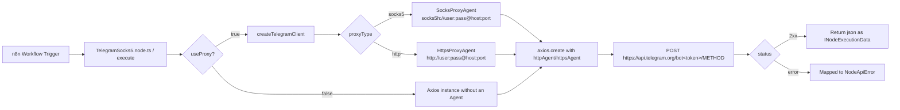

# n8n-nodes-telegram-socks5

[](https://www.npmjs.com/package/n8n-nodes-telegram-socks5)
[](./LICENSE)
[](https://docs.n8n.io/integrations/community-nodes/)

**Author:** Mehdi Jahangard ([mehdi.jahangard@gmail.com](mailto:mehdi.jahangard@gmail.com))

An **n8n** community node for the **Telegram Bot API** with native **SOCKS5** and **HTTP proxy** support — built for infrastructures where direct access to `api.telegram.org` is restricted or blocked.

Unlike n8n's official Telegram node, which relies on the built-in HTTP engine (`this.helpers.httpRequest`, based on the `got` library) and has no SOCKS5 support, this node implements an independent transport layer built on **Axios with an injected Agent**, enabling full traffic routing through a SOCKS5h/HTTP proxy.

---

## Table of Contents

- [Features](#features)
- [Architecture](#architecture)
- [Installation](#installation)
- [Credential Configuration](#credential-configuration)
- [Supported Operations](#supported-operations)
- [Technical Parameter Reference](#technical-parameter-reference)
- [Error Handling](#error-handling)
- [Local Development & Build](#local-development--build)
- [Testing](#testing)
- [Known Limitations](#known-limitations)
- [Roadmap](#roadmap)
- [Contributing](#contributing)
- [License](#license)

---

## Features

| Capability | Description |
|---|---|
| Native SOCKS5 proxy | Via `socks-proxy-agent`, including `socks5h` mode (DNS resolved through the proxy) |
| HTTP/HTTPS proxy | Via `https-proxy-agent` for CONNECT tunneling |
| Proxy authentication | Optional username/password for both proxy types |
| Send text messages | `sendMessage` with `parse_mode`, `reply_to_message_id`, `disable_notification`, `protect_content` |
| Send photos/files | `sendPhoto` / `sendDocument` from a URL, an existing Telegram `file_id`, or an input Binary Property (multipart/form-data) |
| Standard n8n error handling | Axios errors are mapped to `NodeApiError`; `continueOnFail()` is supported |
| Full type safety | Explicit typing with `INodeType`, `ICredentialType`, `IExecuteFunctions` from `n8n-workflow` |

---

## Architecture

### Execution flow diagram



### Why not use `this.helpers.httpRequest`?

n8n's built-in HTTP engine (based on `got`) has no official, stable support for a SOCKS5 agent, and doesn't make it easy to inject a custom `Agent` — especially when dealing with `multipart/form-data` for file uploads. For this reason, the transport layer was built independently with **Axios**, which:

1. Allows a custom `httpAgent` / `httpsAgent` to be injected per Credential.
2. Sets `axios.proxy = false` explicitly, preventing Axios's own proxy mechanism from conflicting with the injected Agent.
3. Uses `form-data` for multipart requests (`sendPhoto`/`sendDocument`), which automatically builds the `Content-Type: multipart/form-data; boundary=...` headers.

### Core code modules

```
nodes/TelegramSocks5/TelegramSocks5.node.ts
├── createTelegramClient(credentials)   → builds an AxiosInstance with the correct baseURL and Agent
├── class TelegramSocks5 implements INodeType
│   ├── description: INodeTypeDescription   → UI definition (fields, operations, displayOptions)
│   └── execute()                            → loops over input items and calls the Telegram Bot API
```

Agent mapping by proxy type:

| `proxyType` | Library | Agent URL format |
|---|---|---|
| `socks5` | `socks-proxy-agent` | `socks5h://[user:pass@]host:port` |
| `http` | `https-proxy-agent` | `http://[user:pass@]host:port` |

> The `socks5h` prefix (rather than `socks5`) is used so that domain name resolution (`api.telegram.org`) also happens through the proxy, preventing a DNS leak.

---

## Installation

### Via the n8n panel (Community Nodes)

1. **Settings → Community Nodes → Install**
2. Enter the package name: `n8n-nodes-telegram-socks5`
3. Confirm installation (n8n will show its standard third-party code security warning)

### Manual installation (self-hosted / Docker)

```bash
cd ~/.n8n/custom   # or the path configured via N8N_CUSTOM_EXTENSIONS
npm install n8n-nodes-telegram-socks5
```

Then restart the n8n service.

### In a Dockerfile

```dockerfile
FROM n8nio/n8n:latest
USER root
RUN npm install -g n8n-nodes-telegram-socks5
USER node
```

---

## Credential Configuration

Credential type: **`telegramSocks5Api`** (displayed as "Telegram (SOCKS5/HTTP Proxy) API")

| Field | Internal Name | Type | Default | Required | Description |
|---|---|---|---|---|---|
| Bot Token | `botToken` | `string` (password) | `''` | Yes | Token obtained from `@BotFather` |
| Use Proxy | `useProxy` | `boolean` | `true` | - | Enables/disables the proxy path |
| Proxy Type | `proxyType` | `options` (`socks5` \| `http`) | `socks5` | When `useProxy=true` | Proxy type |
| Proxy Host | `proxyHost` | `string` | `''` | When `useProxy=true` | Proxy server host/IP |
| Proxy Port | `proxyPort` | `number` | `1080` | When `useProxy=true` | Proxy server port |
| Proxy Username | `proxyUser` | `string` | `''` | No | Optional proxy auth username |
| Proxy Password | `proxyPassword` | `string` (password) | `''` | No | Optional proxy auth password |

### A note on the Test button

n8n's standard credential test mechanism (`ICredentialTestRequest`) sends the request through n8n's internal HTTP engine, which doesn't allow injecting a custom SOCKS5/HTTP Agent. Because of this, the **Test this credential** button only verifies the **Bot Token** with a direct (non-proxied) `GET /getMe` request. Actual proxy-path validation happens when the node executes inside a real Workflow.

---

## Supported Operations

### 1. `Send Message` → `sendMessage`

| UI Parameter | Telegram API Field | Type | Description |
|---|---|---|---|
| Chat ID | `chat_id` | string | Chat identifier or `@username` |
| Text | `text` | string | Message text |
| Parse Mode | `parse_mode` | `Markdown` \| `MarkdownV2` \| `HTML` \| — | How Telegram should parse the text formatting |
| Reply To Message ID | `reply_to_message_id` | number | Send as a reply to this message |
| Additional Fields → Disable Notification | `disable_notification` | boolean | Send silently |
| Additional Fields → Protect Content | `protect_content` | boolean | Prevent forwarding/saving |

### 2. `Send Photo` → `sendPhoto`

### 3. `Send Document` → `sendDocument`

Both operations support three data sources:

| Source | How to configure |
|---|---|
| Remote URL | `Binary Data = false` + `File URL = https://...` |
| Existing Telegram `file_id` | `Binary Data = false` + `File URL = <file_id>` |
| Input binary data (from a previous node) | `Binary Data = true` + `Binary Property = data` (or a custom name) |

Requests for these two operations are built as `multipart/form-data` using the `form-data` library, not JSON.

---

## Technical Parameter Reference

The internal request structure maps directly to the [Telegram Bot API](https://core.telegram.org/bots/api):

```http
POST https://api.telegram.org/bot<BOT_TOKEN>/sendMessage
Content-Type: application/json

{
  "chat_id": "123456789",
  "text": "Hello world",
  "parse_mode": "HTML",
  "reply_to_message_id": 42,
  "disable_notification": false
}
```

```http
POST https://api.telegram.org/bot<BOT_TOKEN>/sendPhoto
Content-Type: multipart/form-data; boundary=...

--boundary
Content-Disposition: form-data; name="chat_id"

123456789
--boundary
Content-Disposition: form-data; name="photo"; filename="image.jpg"
Content-Type: image/jpeg

<binary bytes>
--boundary--
```

---

## Error Handling

```typescript
if (axios.isAxiosError(error)) {
    const description = (error.response?.data as IDataObject)?.description ?? error.message;
    throw new NodeApiError(this.getNode(), (error.response?.data as any) ?? {}, {
        message: `Telegram API request failed: ${description}`,
        description: String(description),
        itemIndex: i,
    });
}
```

- Both network-level errors (timeouts, refused proxy connections, DNS failures) and Telegram API-level errors (e.g. `400 Bad Request: chat not found`) are mapped to `NodeApiError` so a readable message is shown in the UI.
- When **Continue On Fail** is enabled on the node, each item's error is placed in the `error` field of that item's own output, and workflow execution isn't stopped.
- If `proxyHost`/`proxyPort` are missing while `useProxy=true`, an explicit `NodeOperationError` is thrown before any request is attempted (no silent connection attempt).

---

## Local Development & Build

### Prerequisites

- Node.js ≥ 18
- A local n8n installation (for end-to-end testing)

### Steps

```bash
git clone https://github.com/mehdi-jahangard/n8n-nodes-telegram-socks5.git
cd n8n-nodes-telegram-socks5
npm install
npm run build      # tsc + gulp build:icons → output in ./dist
npm run lint        # eslint-plugin-n8n-nodes-base
```

### Linking to a local n8n instance

```bash
npm link
cd ~/.n8n/custom   # or the path set via N8N_CUSTOM_EXTENSIONS
npm link n8n-nodes-telegram-socks5
n8n start
```

### Watch mode during development

```bash
npm run dev   # tsc --watch
```

> Note: code changes require restarting the n8n process; hot-reload isn't supported for community nodes.

---

## Testing

This project currently has no automated unit tests. For manual end-to-end testing:

1. Create a test bot via `@BotFather` and grab its token.
2. Set up an accessible SOCKS5/HTTP proxy server (e.g. `ssh -D 1080`, or a Shadowsocks/3proxy service).
3. Create the credential in n8n with the values above and hit `Test` (this only checks the token).
4. Build a simple workflow: Manual Trigger → TelegramSocks5 (`sendMessage`), and execute it.
5. Inspect traffic on the proxy server (e.g. with `tcpdump`) to confirm traffic is actually going through the proxy, not directly.

The roadmap includes adding Jest plus `nock`/`axios-mock-adapter` for unit-testing the `createTelegramClient` layer and mocking Telegram API responses (see Roadmap below).

---

## Known Limitations

| Limitation | Description |
|---|---|
| No Webhook Trigger | This version only provides outbound actions; a proxy-aware Trigger for receiving updates isn't implemented yet |
| Credential test bypasses the proxy | Due to the `ICredentialTestRequest` limitation in n8n core (explained above) |
| No support for `editMessageText`, `deleteMessage`, `sendVideo`, `sendAudio`, and other Bot API methods | Only the three core operations are implemented in the current MVP |
| `maxContentLength`/`maxBodyLength: Infinity` | Very large files may require a longer `timeout` or streaming instead of buffering |

---

## Roadmap

- [ ] Add a Long Polling-based Trigger with proxy support (`getUpdates`)
- [ ] Add operations: `editMessageText`, `deleteMessage`, `sendVideo`, `sendAudio`, `sendLocation`, `answerCallbackQuery`
- [ ] Add exponential-backoff retry for `429 Too Many Requests` errors (mapped from the `retry_after` header)
- [ ] Unit test coverage (Jest) for `createTelegramClient` and the multipart form-building logic
- [ ] Streaming upload support for large files (instead of buffering the entire file in memory)
- [ ] Publish standalone type definitions for use in other projects

---

## Contributing

1. Fork the repo and create a branch named `feature/<topic>` or `fix/<topic>`
2. Before every commit, run:
   ```bash
   npm run lint
   npm run build
   ```
3. Open a Pull Request with a clear description of the change, and screenshots of the workflow execution in n8n where possible

It's recommended to open an Issue before starting work on a large feature to avoid duplicated effort.

---

## Maintainer

**Mehdi Jahangard**
Email: [mehdi.jahangard@gmail.com](mailto:mehdi.jahangard@gmail.com)

---

## License

[MIT](./LICENSE)
